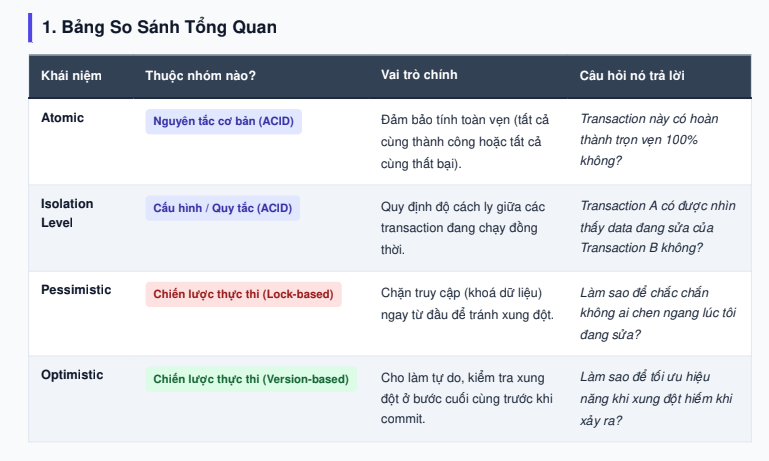

Atomic (Tính nguyên tử): Hoặc thành công 100% hoặc hoàn tác toàn bộ (Rollback).

Isolation Level (Độ cách ly): Cấu hình sự ảnh hưởng giữa các transaction chạy song song (tránh Dirty Read, Phantom Read).

Pessimistic Locking (Khóa bi quan): Dùng FOR UPDATE, thích hợp với ứng dụng tài chính/đặt vé có độ tranh chấp cực cao.

Optimistic Locking (Khóa lạc quan): Dùng cột version, thích hợp với ứng dụng Web / E-commerce ghi ít đọc nhiều để đạt hiệu năng tối đa.

# Pessimistic Locking 
PROs:
-- Prevents conflicts.
-- Ensures data integrity.
-- Suitable for high contention.

CONs:
-- Decreased throughput.
-- Increased deadlock risk.
-- Reduced responsiveness.

Use Case:
Pessimistic locking is often employed in scenarios where conflicts are likely or must be avoided, such as:

Banking systems where transactions involving account balances must be processed serially.
Reservation systems where concurrent bookings for the same resource must be prevented.

# Optimistic Locking
PROs:
--Minimal performance impact.
--Allows concurrent access.
--Suitable for infrequent conflicts.
CONs:
--Risk of conflicts.
--Requires conflict resolution. (retry)
--Not ideal for high contention.

Use Case
Optimistic locking is commonly used in scenarios where the likelihood of conflicts is low, such as:

Content management systems where users rarely edit the same document simultaneously.
E-commerce platforms where product prices are updated infrequently.