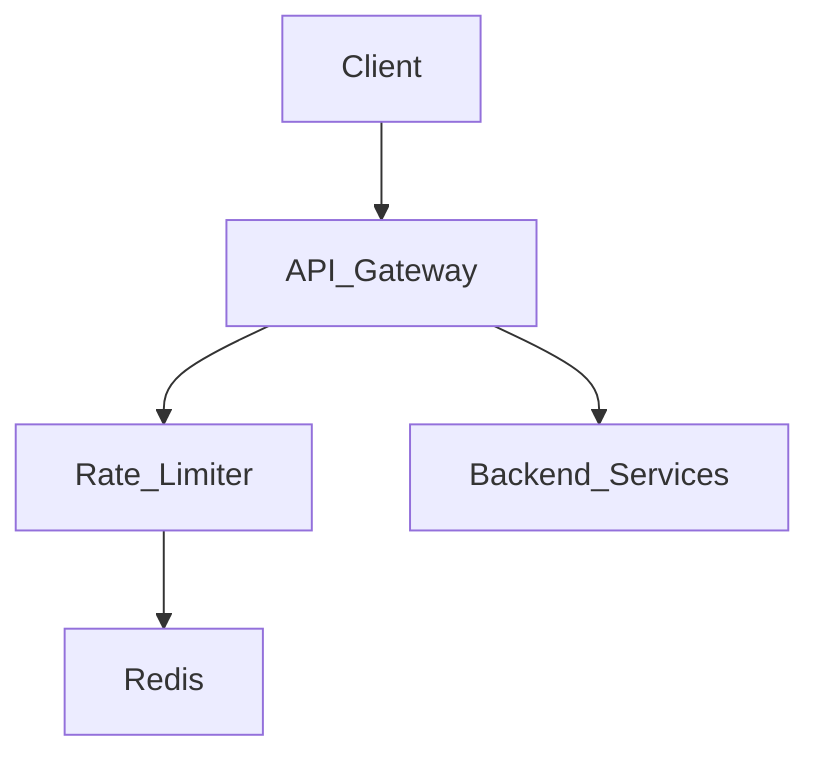
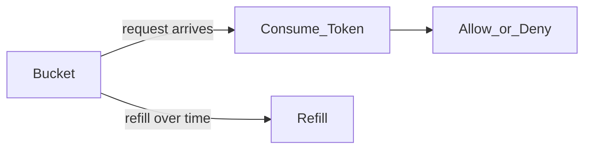

# Distributed Rate Limiter

This document is a markdown export of the Hello Interview article on distributed rate limiting, adapted into a clean article-style format.

## Overview

A rate limiter is a traffic control mechanism for APIs. It decides whether a client is allowed to make another request within a given time window. In practice, it protects services from abuse, prevents overload, and ensures fair usage across users.

The core problem is usually not just “how do we count requests?” but also “how do we do so correctly across many servers and many clients?” For a distributed system, the design must balance correctness, latency, availability, and operational complexity.

## Understanding the Problem

### Functional Requirements

The system should:

1. Identify clients using user ID, IP address, or API key.
2. Enforce configurable rate limits such as “100 requests per minute per user.”
3. Reject excess requests with HTTP 429 Too Many Requests.
4. Return useful response headers such as X-RateLimit-Limit, X-RateLimit-Remaining, and X-RateLimit-Reset.

### Non-Functional Requirements

Assume a large-scale deployment:

- Around 1 million requests per second
- Around 100 million daily active users
- Low latency overhead, ideally below 10 ms per check
- High availability, with eventual consistency acceptable
- Strong protection during traffic spikes and bursts

## The Setup

### Planning the Approach

A good interview answer should show flexibility. The design can be framed as:

- a high-level architecture decision,
- an algorithm choice,
- a distributed state strategy,
- and a response behavior decision.

### Core Entities

The main concepts are:

- Rules: policies that define limits for different clients and endpoints
- Clients: users, IPs, API keys, or combinations
- Requests: incoming operations that must be validated

### System Interface

A typical interface looks like this:

```text
isRequestAllowed(clientId, ruleId) -> { passes, remaining, resetTime }
```

This interface makes it easy to plug the rate limiter into an API gateway or a dedicated service.

## High-Level Design

### Placement of the Rate Limiter

There are three common placement options:

- In-process: simple, but not shared across machines
- Dedicated service: centralizes logic, but adds network overhead
- API gateway / load balancer: often the best compromise

The most common pattern is to place the rate limiter in an API gateway so the check is centralized and near the entry point.



### Client Identification

The limiter needs to identify who the requester is. Common choices include:

- User ID for authenticated users
- IP address for anonymous traffic
- API key for developer APIs

In production, systems often combine multiple identifiers and apply the most restrictive matching rule.

### Limiting Rules

A rate limiter should support layered rules such as:

- Per-user limits
- Per-IP limits
- Global limits
- Endpoint-specific limits

If a user exceeds any applicable limit, the request is rejected.

## Rate Limiting Algorithms

### Fixed Window Counter
The simplest approach divides time into fixed windows (like 1-minute buckets) and counts requests in each window. For each user, we'd maintain a counter that resets to zero at the start of each new window. If the counter exceeds the limit during a window, reject new requests until the window resets.
For example, with a 100 requests/minute limit, you might have windows from 12:00:00-12:00:59, 12:01:00-12:01:59, etc. A user can make 100 requests during each window, then must wait for the next window to start.
This is really simple to implement. It's just a hash table mapping client IDs to (counter, window_start_time) pairs. The main challenges are boundary effects: a user could make 100 requests at 12:00:59, then immediately make another 100 requests at 12:01:00, effectively getting 200 requests in 2 seconds. There's also potential for "starvation" if a user hits their limit early in a window.
{
  "alice:12:00:00": 100,
  "alice:12:01:00": 5,
  "bob:12:00:00": 20,
  "charlie:12:00:00": 0,
  "dave:12:00:00": 54,
  "eve:12:00:00": 0,
  "frank:12:00:00": 12,
}


This approach divides time into fixed intervals, such as one-minute windows. It counts requests within each window and resets the counter at the boundary.

Pros:

- Very simple to implement
- Cheap in memory

Cons:

- Boundary effects can allow bursts near the window edge
- Not ideal for smooth enforcement

### Sliding Window Log

This tracks a log of request timestamps for each client and evaluates only the recent window.


This algorithm keeps a log of individual request timestamps for each user. When a new request arrives, you remove all timestamps older than your window (e.g., older than 1 minute ago), then check if the remaining count exceeds your limit.
This gives you perfect accuracy. You're always looking at exactly the last N minutes of requests, regardless of when the current request arrives. No boundary effects, no unfair bursts allowed.

The downside is memory usage. For a user making 1000 requests per minute, you need to store 1000 timestamps. Scale this to millions of users and you quickly run into memory problems. There's also computational overhead scanning through timestamp logs for each request.


Pros:

- Very accurate
- No boundary effect

Cons:

- Higher memory usage
- More expensive to process

### Sliding Window Counter
This is a clever hybrid that approximates sliding windows using fixed windows with some math. You maintain counters for the current window and the previous window. When a request arrives, you estimate how many requests the user "should have" made in a true sliding window by weighing the previous and current windows based on how far you are into the current window.
For example, if you're 30% through the current minute, you count 70% of the previous minute's requests plus 100% of the current minute's requests.
This gives you much better accuracy than fixed windows while using minimal memory. It's just two counters per client. The trade-off is that it's an approximation that assumes traffic is evenly distributed within windows, and the math can be tricky to implement correctly.


This is a hybrid that approximates sliding-window behavior using two counters and some math.

Pros:

- Better accuracy than fixed windows
- Lower memory usage than full logs

Cons:

- Approximate, not exact
- Slightly more complex logic

### Token Bucket
Think of each client having a bucket that can hold a certain number of tokens (the burst capacity). Tokens are added to the bucket at a steady rate (the refill rate). Each request consumes one token. If there are no tokens available, the request is rejected.
For example, a bucket might hold 100 tokens (allowing bursts up to 100 requests) and refill at 10 tokens per minute (steady rate of 10 requests/minute). A client can make 100 requests immediately, then must wait for tokens to refill.
This handles both sustained load (the refill rate) and temporary bursts (the bucket capacity). It's also simple to implement, you just track (tokens, last_refill_time) per client. The challenge is choosing the right bucket size and refill rate, and handling "cold start" scenarios where idle clients start with full buckets.


This is the most popular choice for modern APIs. Each client carries a bucket of tokens. Tokens are refilled at a steady rate, and each request consumes one token.

Pros:

- Handles bursts well
- Supports steady-state rate limits
- Memory-efficient

Cons:

- Requires careful tuning of bucket size and refill rate



## Distributed Design

For a distributed system, the shared state must be accessible to every gateway instance.

A common design uses:

- API gateways to check requests
- Redis as the shared state store
- atomic operations to avoid race conditions

### Why Redis?

Redis is commonly used because it is:

- fast,
- in-memory,
- easy to replicate,
- and suitable for atomic read-modify-write patterns.

### Atomicity and Race Conditions

A subtle problem appears when two concurrent requests for the same client both read the same state and both decide to allow the request. The fix is to make the whole check-and-update flow atomic.

This can be done with:

- Redis transactions,
- Lua scripts,
- or other atomic primitives supported by the store.

## Handling Rejections

When a client exceeds the limit, the system should reject the request with HTTP 429 Too Many Requests.

Useful headers include:

- X-RateLimit-Limit
- X-RateLimit-Remaining
- X-RateLimit-Reset
- Retry-After

Example response:

```http
HTTP/1.1 429 Too Many Requests
X-RateLimit-Limit: 100
X-RateLimit-Remaining: 0
X-RateLimit-Reset: 1640995200
Retry-After: 60
```

## Potential Deep Dives

### Scaling Writes

At high scale, a single Redis instance is often not enough. The system should shard the data by client identifier, often with consistent hashing or Redis Cluster.

### High Availability

The limiter should be resilient to failures. Typical strategies include:

- master-replica replication,
- failover,
- fail-closed or fail-open policies depending on the product requirement.

### Latency Optimization

To keep checks fast, systems often use:

- connection pooling,
- regional deployment,
- and careful tuning of the data store.

### Hot Keys

A single user or IP can create very high contention. This is often caused by abuse or a legitimate but noisy client. Strategies include client-side smoothing, request batching, or temporary blocking.

### Dynamic Rule Configuration

Rules often need to change at runtime. A common approach is to store rules in a configuration store and push updates to the gateway or rate limiter service.

## What Is Expected at Each Level?

### Mid-level

A mid-level candidate should be able to:

- explain the core requirements,
- choose a reasonable algorithm such as token bucket,
- place the limiter in an API gateway,
- and mention Redis as shared state.

### Senior

A senior candidate should also discuss:

- trade-offs between algorithms,
- atomicity and race conditions,
- sharding and Redis Cluster,
- fail-open versus fail-closed decisions,
- and hot-key handling.

### Staff+

A staff-level candidate should go further and discuss:

- multi-region deployment,
- observability,
- gradual rollout,
- operational safeguards,
- and production-grade failure handling.

## Summary

A distributed rate limiter is a foundational system design problem because it combines business rules, algorithms, and distributed systems concerns. The most common production answer is to:

- place the limiter at the API gateway,
- identify clients clearly,
- use a token bucket or similar algorithm,
- store shared state in Redis,
- and return HTTP 429 with helpful headers when limits are exceeded.
